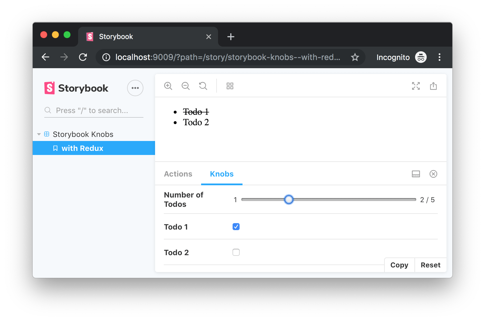

# Storybook Knobs with Redux example

I made this project to show a "simple" way to update, with [Storybook](https://storybook.js.org)
(and its [Knobs addon](https://www.npmjs.com/package/@storybook/addon-knobs)), a Redux-connected
component.

I started from the basic [Redux Todo
example](https://github.com/reduxjs/redux/tree/master/examples/todos).

To play with it:
```bash
npm i && npm run storybook
```

Enjoy


See the [story source code](src/stories/index.js#L16-L49).

### Why should I control the Redux state from Storybook Knobs?

That's just a demo, if you think to do something similar, be aware that

- a Redux connected container should consume a pure component. A pure component doesn't need a
  container to be added to Storybook
- if you have a container with a huge number of prop transformations, probably you should
  rethink your components hierarchy creating some simpler, single-responsibility, components
- if you don't need to let the user control the state, you could just use the second argument
  (`preloadedState`) of the [createStore API](https://redux.js.org/api/createstore#createstorereducer-preloadedstate-enhancer)
